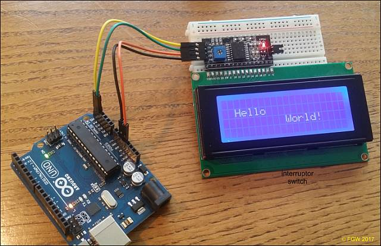

# I2C Displays

DCC++ EX is designed to accommodate a display. You don't need a display since the Control Station is often hidden away under the layout. However, if you like the idea of a nice visual display for your panel, just about any I2C (serial to parallel interface) display will work. We recommend either a 20 character by 2 line or 4 line display. The code is easily configurable in order to change the display settings, as well as add or change what is printed on the display.

*** Under Construction, more coming soon ***

