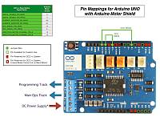

# Motor boards

There are many motor boards available to use with DCC++ EX. Also called "Dual-H Bridges" and "Motor Shields", some require a little work, but others are mostly plug and play.

NOTE: We recommend the Arduino Motor Shield R3 or a supported clone board like the Deek-Robot ($15 US).

## Boards currently supported

* Arduino Motor Shield R3
* Deek-Robot Motor Shield
* LMD18200 Motor Driver Module
* Pololu MC33926 Motor Shield
* LMD18200 Based Motor Boards

There are other boards, some requiring modification, which are covered in the advanced section.

## Connecting an Arduino or Deek-Robot Motor Shield

[Jumper Diagrams](../assets/motor-shield-pin-mappings.pdf) 

The link above will open a PDF document that provides detail information on how to connect the most popular motor controllers to an Arduino.

