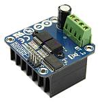

# Motor boards

There are many motor boards available to use with DCC++ EX. Also called "Dual-H Bridges" and "Motor Shields". Some require a little work, but others are mostly plug and play.

!!! Note
    We recommend the Arduino Motor Shield R3 or a supported clone board like the Deek-Robot ($15 US).

## Boards currently supported

* Arduino Motor Shield R3
* Deek-Robot Motor Shield
* DIY More L298HN Motor Shield
* LMD18200 Motor Driver Module
* Pololu MC33926 Motor Shield
* LMD18200 Based Motor Boards
* BTS7960 Based Motor Boards

There are other boards, some requiring modification, which are covered in the advanced section.

## But I saw this board, will it work?

This is a checklist for what your motor controller needs to work with DCC++ EX:

* A dual H-Bridge (one for MAIN and one for PROG)
* Handle enough current for the layout (most boards support 2 Amps, enough for 3-5 locos)
* Have working current sense (many do not)
* Be able to allow our fast switching speeds (some do not)
* Plug on shield to eliminate wiring (optional feature)

## Work with little or no modification (Conductor friendly)

* Arduino Motor Shield R3
* Deek-Robot Motor Shield
* DIY More L298HN Motor Shield

### Arduino Motor Shield

### Deek-Robot Motor Shield

### DIY More L298NH Motor Shield

## Need a little tinkering (Tinkerer path)

The following are not shields, they are discrete boards. You will need to connect them with wires.

* L298 Motor Driver - Almost identical to the Arduino Motor Shield except it needs to be wired
* LMD18200
* BTS70960 - The "IBT_2" board. This board also has separate direction pins, so after selecting the correct motor board type in the config.h, it will use one more of the Arduino's pins.
* L6201P/6203

### L298 Motor Driver (dual)

This is an alternative to the Arduino and Deek-Robot shields. It uses the same L298 chip only in a different form factor and with better cooling. You would need to connect jumper wires from the correct pins on the Arduino to this board. IMPORTANT: You will also need to snip two long chip pins and add 2 resistors to enable current sense to have overload protection and be able to acknowledge CV reads and writes. As with any of these boards with current sense issues, you can also add a small current sense board like the MAX471

### BTS7960 IBT_2 Board (single)

You will either need 2 of these or one of these and another board to run your programming track. These boards can provide high current. Indeed, we have built boosters using these boards. If the 2 Amps (really 1.5A) of the L298 boards aren't enough for your track, this is one of the best options.

## Need more modification (Engineer path)

* __Keyes/Fundumoto__ (aka "Beeper Board") - You have to lift two traces and solder 2 resistors and use 2 jumpers to the current sense pins. This board is immediately recognizable because it has a cylindrical beeper or buzzer on the board..
* __Velleman KA03 (kit) VMA03 (soldered)__ - Must cut traces and solder resistors to get current sensing on the soldered board. Much easier to simply not solder the pins on the kit version. Pin assignments must be added to a new motorboard entry in the config.h file.
* __Pololu MC33926__ - Comes soldered or in a kit where you just have to solder the headers and connector. While we have a motor board type for this board, the current sense is not acceptable. We recommend using an external current sense board like the MAX471. Many people however use this board.

### Keyes/Fundumoto ("Beeper Board")

### Velleman KA03 (kit) VMA03 (soldered)

### Pololu MC33926

## Boards that are NOT compatible for use with DCC

* VNH2SP30 - Sparkfun Monster Moto and other boards from China based on this chip. It can't switch fast enough to generate a reliable DCC signal
* IFX9202ED - Infineon Dual H-Bridge. Can't switch fast enough.
