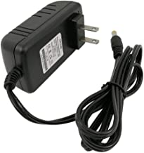
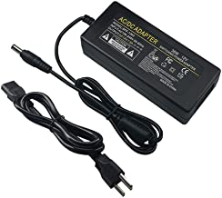
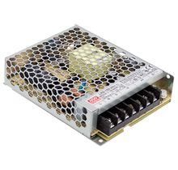
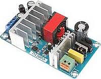
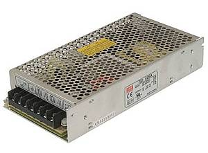

# Power Supplies

The power supply is one of the most important parts of your setup. You need to select a clean, filtered power supply that can supply at least the amount of current required by your motor controllers. 

## Do I need two power supplies?

Both your microcontroler (the Arduino) and the motor controller need power. While we recommend a 9 Volt, 1 Amp, DC power supply for the microcontroler, there are other ways to power it. The voltage to the motor controller does not change, you need the correct voltage and amperage for your guage and layout.

### Three ways to power the Arduino

__Barrel Connector__ - This is where we can connect our 7-9V DC supply. The power goes through a voltage regulator on the Arduino and converts the 9V to the 5V the board can use. You will still need a separate one for the motor controller.

__Vin pin__ - You can connect a 7-9V DC power supply with jumper wires. The positive from the power supply goes to Vin and negative to any pin marked "gnd" for ground. This also uses the voltage regulator on the Adruino to convert your supply voltage to 5V. You will still need a separate poer supply for the motor controller.

__USB Connector__ - If you always will have a computer connected to your Command Station (for example when using JMRI), the 5V from your computer can power it. You won't need another power supply. Most USB ports can only supply 500 milliamps, so be careful about adding anything that will draw current from the CS. A motor shield, a wifi shield and a fan that draws 50mA should be fine. Even if you don't have a laptop, you can use a 5V, 1A USB power supply like a phone charger and connect it to the USB port.

__5V pin__ - You can connect a good quality 5V power supply directly to the 5V pin and ground. This bypasses the voltage regulator on the board which means you can use more current. We recommend a 5V, 1A power supply. Since there are many dual-voltage power supplies on the market, you can use one power supply with two outputs.

!!! Note
    We recommend only a 7-9V DC power supply for your Arduino because, despite what may be said on a specification sheet, anything over 5V is generated as heat in the voltage regulator on an Arduino. There is a 2V voltage drop in this regulator, so you need a minimum of 7 volts to power the board. 7-9 is perfect. If you used 12V and connected a WiFi board or other devices that also use the 5V power supply on the arduino, the voltage regulator is likely to overheat.

### Powering the Motor Controller

#### Voltage

N and Z scale layouts should run at at about 12V-14V to avoid damage to the motors. See this thread to learn more about the pros and cons of running at higher voltages at this [Trainboard Thread](https://www.trainboard.com/highball/index.php?threads/dcc-voltage-and-n-scale-locomotives.56342/) Another good link (along with just about anything written by Mark Gurries, is here: [Mark Gurries - Choosing the Right Booster](https://sites.google.com/site/markgurries/home/technical-discussions/boosters/choosing-the-right-booster)

Most larger scales will run higher voltages. For reference, the Digitrax systems put the rails at around 14V. Do some homework to determine what voltage is best for your system. The last thing you want it to cause the wrong kind of smoke to come out of your expensive prized brass locomotive!

#### Amperage

You'll need to be able to supply 3A on channel A to the MAIN track (assuming you're using the Arduino motor shield or Pololu motor shield). Channel B for the programming track will only be used occasionally and does not need much current. In fact, it is limited to protect your trains. For larger layouts with higher current requriements on the MAIN track and a motor driver that can handle those currents, you'll want power supply that can deliver that current.

!!! Note
    If you think you need more that 5 Amps to your track (you can power accessories and other things from the same power supply if it can deliver the current), you should think about using boosters and power districts.

## Recommended Power Supplies

- Wall warts are a good choice for beginners and those not comfortable with mains wiring. You can get a 12V, 3A, relatively small one for around $8 US. 

- You can also find plenty of laptop type "brick" power supplies. They come in ranges from 12V to 18V and 3-5 Amps.

- The Meanwell LRS-100-15 power supply is a good choice for larger scales. It supplies 15V and 105W (that's 7 amps), so it is plenty for running two channels simutaneously. At only $18, it is an inexpensive and solid option.

[See on Digi-Key](https://www.digikey.com/product-detail/en/mean-well-usa-inc/LRS-100-15/1866-3313-ND/7705005)

### Dual voltage power supplies

With a dual voltage power supply, you can provide 12V for the motor controller and 5V for the Arduino. You may also be able to find higher voltage units if you need such as 14-15V if your scale trains require it.

- Noyito Dual Voltage Power Supply (5V and 12V) 

 

[See on Amazon](https://www.amazon.com/NOYITO-AC-DC-100-260V-Industrial/dp/B07C2MMKW3/ref=sr_1_5?dchild=1&gclid=Cj0KCQiA7qP9BRCLARIsABDaZzgcNBQa99ko_BYBoSTxTGIZuB9GoYK-TFpl60WNx03CvLgTFok6bAYaAlSiEALw_wcB&hvadid=324303069966&hvdev=c&hvlocphy=9009681&hvnetw=g&hvqmt=e&hvrand=7010757700566373545&hvtargid=kwd-340617046695&hydadcr=18944_9701035&keywords=dual+voltage+power+supply+12v+5v&qid=1604962964&sr=8-5&tag=googhydr-20)

- Mean Well Dual Voltage Power Supply (5V and 12V) 

 

[See on Amazon](https://www.amazon.com/MEAN-WELL-RD-125A-Supply-Output/dp/B005T9FF4I/ref=sr_1_10?dchild=1&gclid=Cj0KCQiA7qP9BRCLARIsABDaZzgcNBQa99ko_BYBoSTxTGIZuB9GoYK-TFpl60WNx03CvLgTFok6bAYaAlSiEALw_wcB&hvadid=324303069966&hvdev=c&hvlocphy=9009681&hvnetw=g&hvqmt=e&hvrand=7010757700566373545&hvtargid=kwd-340617046695&hydadcr=18944_9701035&keywords=dual+voltage+power+supply+12v+5v&qid=1604962964&sr=8-10&tag=googhydr-20)

  - For the metal box type power supply, you will need to do your own mains wiring, if you don't have experience with this get a friend who does or hire an electrician to do it for you. MAINS POWER IS DANGEROUS.