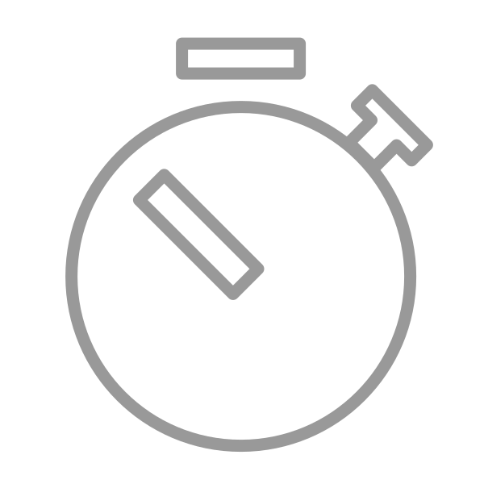
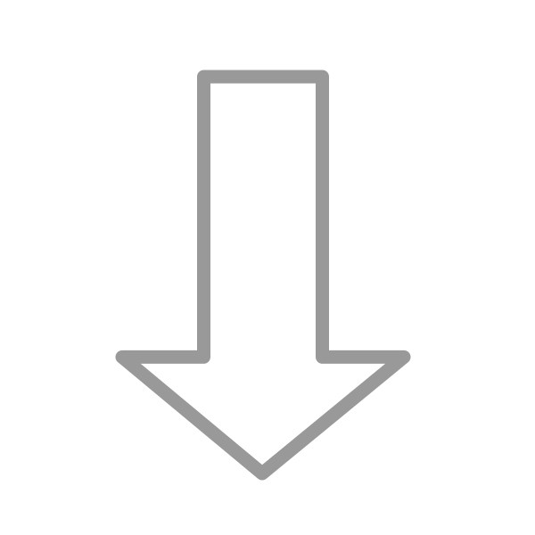
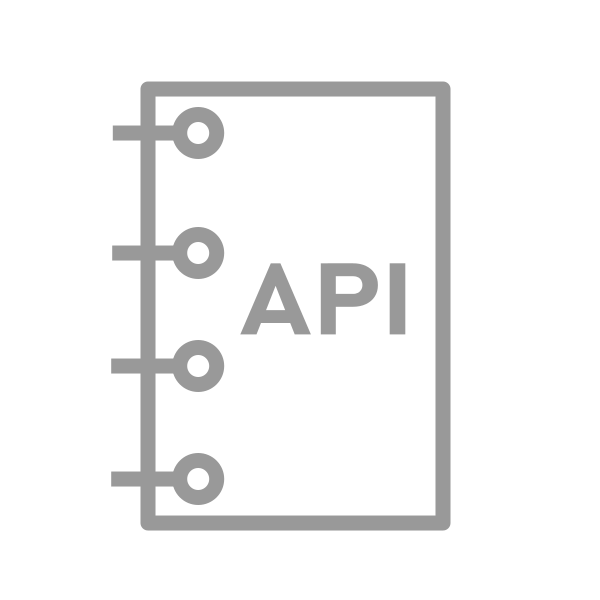
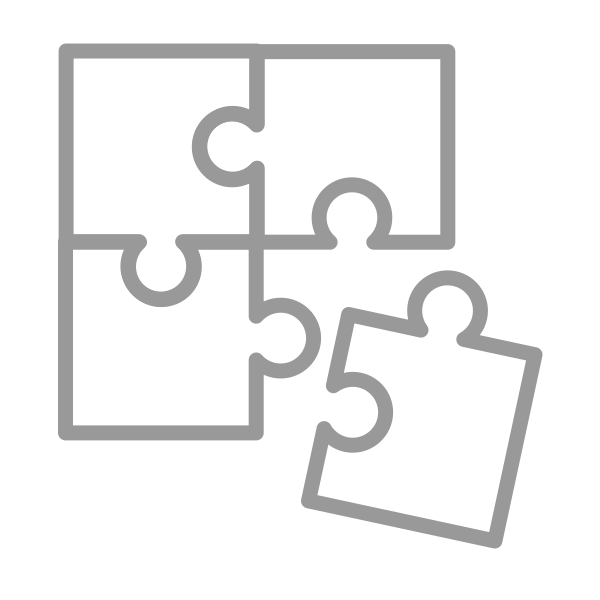

# Welcome to DCC++ EX # {: .title}
An open-source hardware and software platform for the operation 
of DCC-equipped model railroads.
{: .descript}

DCC++ EX is an open-source hardware and software platform for the operation of DCC-equipped model railroads, based on Gregg E. Berman's DCC++ original code. DCC++ EX picks up where Gregg left off. Our team has released "DCC++ Classic", a stable release of Gregg's original code with bug fixes and minor improvements. Today we continue development with a new version called "DCC-EX" that includes enhancements and upgrades.

|                       |                   |                       |
|       :---:           |       :---:       |         :---:         |
|  [ ](./start/levels.md) [Quick Start](./start/levels.md) | [ ](./download/dccex-downloads.md) [Downloads](./download/dccex-downloads.md) | [ ](./reference/command-reference.md) [Reference](./reference/command-reference.md) |   
| [ ](./start/dccpp-jmri.md) [Advanced Setup](./start/dccpp-jmri.md) | [ ](./support/get-support.md) [Support](./support/get-support.md) | [ ](./about/about-us.md) [Contribute](./about/about-us.md) |

## Mission
Our mission is to make the world of model railroading universally accessible.

To achieve that, DCC++ EX provides the model railroad community with a complete, open source DCC (Digital Command Control) system - one that is simple, affordable, and expandable, to control model trains and accessories. Further, it is our goal that this project be organized, documented, and maintained so that it can continue far into the future.

## What is DCC++ EX?
DCC++ EX is the organization maintaining several codebases that together represent a fully open source DCC system. Currently, this includes the following:

* [CommandStation-EX](https://github.com/DCC-EX/CommandStation-EX/releases) - the latest take on the DCC++ command station for controlling your trains. Runs on an Arduino board, and includes advanced features such as a WiThrottle server implementation, turnout operation, general purpose inputs and outputs (I/O), and JMRI integration.
* [exWebThrottle](https://github.com/DCC-EX/exWebThrottle) - a simple web based controller for your DCC++ command station.
* [BaseStation-installer](https://github.com/DCC-EX/BaseStation-Installer) - an installer executable that takes care of downloading and installing DCC++ firmware onto your hardware setup.
* [BaseStation-Classic](https://github.com/DCC-EX/BaseStation-Classic) - the original DCC++ software, packaged in a stable release. No active development, bug fixes only.

A basic DCC++ EX hardware setup can use easy to find, widely avalable Arduino boards that you can assemble yourself.

Both CommandStation-EX and BaseStation-Classic support much of the NMRA Digital Command Control (DCC) [standards](http://www.nmra.org/dcc-working-group "NMRA DCC Working Group"), including:

* simultaneous control of multiple locomotives
* 2-byte and 4-byte locomotive addressing
* 128-step speed throttling
* Activate/de-activate all accessory function addresses 0-2048
* Control of all cab functions F0-F28
* Main Track: Write configuration variable bytes and set/clear specific configuration variable (CV) bits (aka Programming on Main or POM)
* Programming Track: Same as the main track with the addition of reading configuration variable bytes

## What's new in CommandStation-EX?

* WiThrottle server built in. Connect Engine Driver or WiThrottle clients directly to your Command Station
* WiFi and Ethernet shield support
* No more jumpers or soldering!
* Direct support for all the most popular motor control boards
* I2C Display support
* Improved short circuit detection and automatic reset from an overload
* Current reading, sensing and ACK detection settings in milliAmps instead of just pin readings
* Improved adherence to the NMRA DCC specification
* Complete support for all the old commands and front ends like JMRI
* Railcom cutout (beta)
* Simpler, modular, faster code with an API Library for developers for easy expansion
* New features and functions in JMRI
* Automation (coming soon)

NOTE: DCC-EX is a major rewrite to the code. We started over and rebuilt it from the ground up! For what that means to you, click [HERE](notes/rewrite.md).

## Sign me up!

To learn more about how to build your own DCC++ EX station, go to the [Getting Started](./start/levels.md) page!
