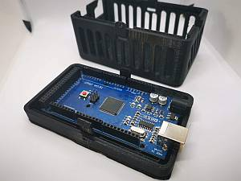

# Hardware, Software, and Accessory Suppliers

## Cases / Enclosures

###  [Chesterfield Model Making & Miniature Electronics](https://chesterfield-models.co.uk/)

Chesterfield sells a case to fit the Mega DCC-EX Command Station as well as a tiny decoder adapter board (The Dave Falkenburg optoisolator board to pickup the DCC signal from the tracks) that can connect to a microcontroller and operate as a decoder or DCC packet sniffer with the right sketch (See the [Myna Bay Website](http://www.mynabay.com/dcc_monitor/)). 

[Chesterfiled DCC-EX Command Station Case](https://chesterfield-models.co.uk/product/dcc-3d-printed-case/)