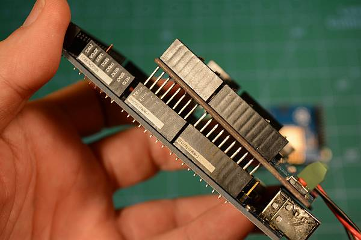

# Assembly

Let's start with the basics and add as you see fit. For this install, you need the following:

* An Arduino Mega or compatible
* An Arduino Motor Control Board or compatible
* A USB-A Male to USB-B Male cable, aka USB Printer cable (or Micro USB for some Arduino Mega clones)
* 18 to 16 AWG twisted pair hookup wire to connect the CS (Motor Controller outputs) to your tracks
* A 7-9V DC Power supply with a 2.5mm barrel connector for the Mega
* A 12V-15V power supply for the Motor Shield (See fig <link> for proper voltage)
* A 2.5mm x 5.5mm Female DC Plug to Screw Terminal (if you don't want to strip wires on your power supply)

{: align=center }
figure 1 - basic setup

For an Uno, Nano or other microcontroller, or if you wish to use a different motor controller (for example to have more current to operate more trains and accesories), see *** link coming soon ***

For a video on how to do this, click here *** link coming soon ***

## 1. BEFORE YOU BEGIN, Cut the Vin trace on the motor controller

We recommend you use two separate power supplies (or one power supply that can deliver two different voltages) one for the Arduino Mega and the other for the Motor Controller to power your tracks. You will need to turn the motor controller board upside down and cut the trace indicated in the picture with a razor blade or x-acto knife. 2 or 3 firm scratches through the trace should do it. Do not cut too deep. Both a magifier and an ohmmeter would be helpful here. The little vertical line in between the two solder pads is the scratch mark from where we cut through the little solder trace. 

By default, the motor controller connects its power supply via the pins, to the Arduino. This can supply two much voltage to the Arduino. If you do not cut this trace, you could damage the Arduino Mega if you either apply more than 12V to the motor shield, or use the 2 power supplies as recommended.

{: align=center }
 figure 2 - Cutting the Vin trace

If you have an ohmmeter, touch your probes to each side of the trace pads and make sure the reading is infinite. In other words, make sure the trace is cut and there is no longer continuity between the two pads on the trace.

## 2. You need to connect the motor shield on top of the Arduino.

NOTE: It is very easy to misalign the pins and then either have trouble diagnosing problems or damage the board!

Here are some tips:

* There are power connectors on both boards. They must point in the same direction
* There are outdented "tabs" on the opposite end of the board. They must point in the same direction.
* The pin numbers on both boards must align (pin 1 goes to pin 1, gnd goes to gnd, etc)
* With the power connectors to your right, align the pins facing you first (pins 0-12, aref, gnd, etc.)
* Look at the pins on the motorboard and make sure they are all straight and line up in a neat row

Place both boards on the table with the power connector end facing in the same direction

{: align=center }
 Figure 3 - Properly orient the boards

a. Did you remember to cut the trace on the motor shield? If not, see above. Otherwise, sight down both rows of pins on the motor board and make sure they are all straight. They should all light up in a row and not be bent in any plane just like the teeth on a comb. If any look like the photo below, bend them with your fingers and/or needle nose pliers.

{: align=center }
 figure 4 - Bent pins

b. Line up the pins on the side of the board closest to the USB with the header connector on the Mega first. You want to line up pins 0-7 on the Mega with the same pins on the motor board. See the picture below and notice the small gap between the two sets of pins to match the two pin header sockets.

{: align=center }
 figure 5 - Line up left side first

c. Just align them and start to push them in but don't push them all the way in. Use your fingers to try to push the pins to get them to all to into the holes.

{: align=center }
 figure 6 - Get all the pins started

d. Do the same on the other side. Get all the pins aligned and start to press gently to get them into the holes. Notice on this side, you have more holes than you do pins. This is normal.

{: align=center }
 figure 7 - Start the other side

e. Now, being careful to not bend any pins gently press, using a rocking motion if you need to, in order to get the motor board to seat firmly onto the Mega. Press gently until you feel you can't put the pins in any further. Don't force anything.

{: align=center }
 figure 6 - Gently press the boards together

f. The boards should be seated. Note the pins are longer than the headers. It is normal for you to see a few millimeters of the pins between the bottom of the motor board and the top of the headers. Figure 7 shows the boards as they look properly seated.

{: align=center }
 figure 7 - The boards when fully sesated

Check your work. Look under and through where the boards connect, make sure no pins missed the holes and got bent so that they run along the outside of the headers.

## 3. Connect your power supply to the motor shield (But don't plug it in yet!) 

__WARNING__: Make sure you have cut the trace on the motor control board. If not, see above first. Once you know the trace is cut, connect power to the motor board

Make sure you have a power supply with the correct voltage and current rating. <see selecting your power supply>

If you are using a "bench" or metal box type power supply, simply connect the DC output of the power supply to the DC input of the motor shield. Make sure that the positive screw terminal (+) is connected to the positive terminal (Vin) of the motor shield and the negative terminal (- or gnd) is connected to the negative (gnd) terminal of the motor shield

{: align=center }
 figure 8 - Power in to Motor Shield

If you are using a laptop style "brick" power supply or an adapter that plugs into the wall (aks wall wart), use the barrel connector to screw terminal adapter to connect your power supply to the Vin and ground pins on the motor shield. Be careful to use the correct polarity. Make sure the positive terminal on the screw terminal adapter connects to the positive (+) on the motor shiel and the negative terminal (- or gnd) connects to the negative terminal.

{: align=center }
 figure 9 - Screw Terminal Adapter to Motor Shield

If you don't have a screw terminal adapter, you can cut the end off your power supply and strip the wires. The outer wire braid is the negative connection and the center wire is the positive connection.

## 4. Connect the power wires to the tracks

There are two sets of output connectors on the motor shield, "A" and "B". A is the main or operations (also called "Ops") track while B is the programming or service track. <see here for an explanation of the two types of tracks> Connect twisted pair wire of the proper gauge <see selecting your wire guage> to each track. Polarity it non important here, but if you will be using a siding track instead of a separate, unused piece of track, make sure that the positive and negative for both tracks match. In other words, if you view one side of your main track as having a "left" side and a right side, and connect positive of output A to the left side, connect the positive from the B side to the left side of the programming track. In electrical terms, we want both tracks to be "in phase" with each other. Here is the diagram from above repeated again for reference.

{: align=center }
 figure 10 - Out to Main and Program tracks

## 5. Connect the power supply to the arduino (but )don't plug it in yet!)

Connect the 2.5mm barrel connect from your separate 7-9V DC powersupply to the barrel connector on the Arduino

<pic coming soon>

## 6. Download and install the DCC++ EX Software for your Command Station

Keep your USB cable handy because we are going to need it in the next step. Click on one of the links below to see how to install the software. 

If you are a "Conductor" (Click to see [user levels / path choice](levels.md)), we recommend using our installer. It is the simplest and quickest way to get started since it walks you through a simple process by letting you select any options from simple dropdowns and then installs everything you need. 

If you are a "Tinkerer" or "Engineer", you may prefer using the Arduino IDE. Many of you may have already used the Arduino IDE and be familiar with it. The Arduino IDE is a very simple "Integrated Development Environment" that lets you open the DCC-EX project files, edit your config file or even your main program file, upload it to the Arduino, and then monitor or interact with the Command Station for testing.

<Use the automated installer>

<Use the Arduino IDE>

## TECHNICAL NOTES

__Wire Gauge__ - The Arduino Motor controller can only provide about 1.5 Amps of power (despite being rated for 2), so 18 AWG wire is ample. If you use a different motor controller and deliver more current to your track, you may need thicker wire.

__Power Supplies__ - Why do we recommend a 7-9V power supply for the Mega when the manual says it can handle 12V or even 20? Can't you just use one 12V power supply to power both of them? Short answer; NO. You want two supplies (or one supply that splits out 2 voltages). The Arduino Mega only needs around 7V to operate. Any voltage over that is wasted as heat and can burn out the regulator on the board. And most people want a minimum of 12V into the Motor Board, while many want 14 (for N and HO Scale). Where your Mega could run hot for a while with 12V, if 14V from the Motorboard was connected to the Mega, it would destroy it. Cut the trace and use 2 power supplies.

Install using the Automated Installer

Install manually using the Arduino IDE

[Power Supplies](../hardware/power-supplies.md)

<adding wifi next also?>

Next Page: [Basic Install/Setup](basic-setup.md)