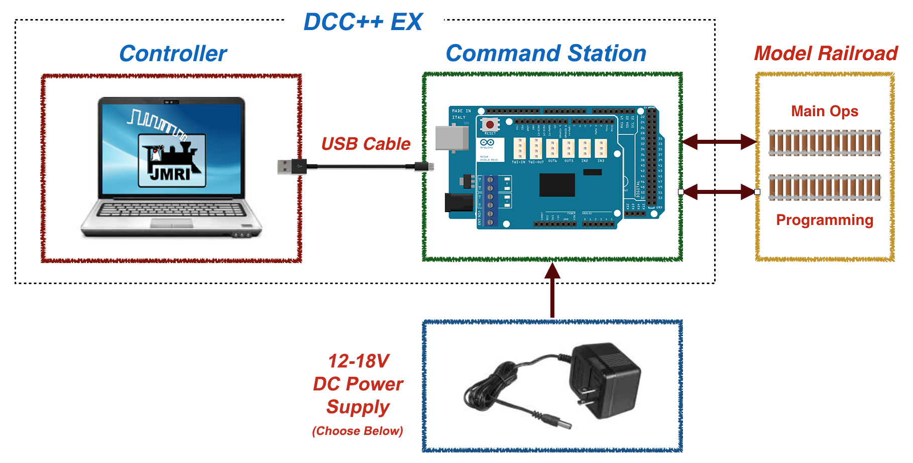

# DCC++ EX Starter Kit

This guide is designed for do-it-yourselfers to build their own system. Anyone can do it, however if you don't feel technically inclined or just want to save the time, you can purchase a starter kit that contains:

* __Controller:__ A Raspberry Pi with SD Card already configured with everything you need including the JMRI software. 
* __Base Station:__ An Arduino with DCC++ software already uploaded and a Motor Controller Shield prepped and installed

NOTE: Keep in mind that if you just want to run trains and start without the separate Raspberry Pi and JMRI, you purchase just the Arduino Mega and Motorshield combination and use exWebThrottle.

*Suppliers list coming soon*

# What You Will Need

- A "main" track aka "operations" track - most people already have this, it's your layout
- A "programming" track aka "service" track - a short section of track that you will use to program locomotives and other pieces equipment that use "accessory decoders"
- A known-good locomotive equipped with a DCC decoder. You may want this to have sound capability

### Equipment List:

#### Hardware

* A compatible Arduino Board
    * Arduino Mega (clones work too)
    * Arduino UNO R3 (clones work too)
    * Arduino Nano
* A compatible motor driver shield
    * Arduino Motor Driver Shield Rev 3 (clones work too)
    * Pololu MC33926 Dual Motor Driver Shield (https://www.pololu.com/product/2503)
    * Other boards listed in the hardware section
* DC Power Supply (see [Power Supplies](../hardware/power-supplies.md)) 
* USB A to B Cable (aka USB Printer Cable) to connect your Pi or computer to the Arduino
* A MicroSD Card (for the Raspberry Pi if you choose to use one)
* Computer to act as a controller to the Arduino Base Station \*

We recommend:

[Elegoo Mega 2560](https://www.amazon.com/ELEGOO-ATmega2560-ATMEGA16U2-Projects-Compliant/dp/B01H4ZLZLQ/ref=asc_df_B01H4ZLZLQ/?tag=hyprod-20&linkCode=df0&hvadid=309743296044&hvpos=&hvnetw=g&hvrand=2075336217815630856&hvpone=&hvptwo=&hvqmt=&hvdev=c&hvdvcmdl=&hvlocint=&hvlocphy=9009681&hvtargid=pla-490931309987&psc=1)

[Deek-Robot Motor Shield](https://www.aliexpress.com/item/32832049214.html?src=google&src=google&albch=shopping&acnt=494-037-6276&isdl=y&slnk=&plac=&mtctp=&albbt=Google_7_shopping&aff_platform=google&aff_short_key=UneMJZVf&&albagn=888888&albcp=1582410664&albag=59754279756&trgt=743612850874&crea=en32832049214&netw=u&device=c&albpg=743612850874&albpd=en32832049214&gclid=CjwKCAjwrcH3BRApEiwAxjdPTQJGRS7xnxV6FvOM14ZyRdKZHZiOUmS5oI74ytkxk5biSFBRGnazaxoCXaEQAvD_BwE&gclsrc=aw.ds)

[12V 5Amp Power Supply](https://www.amazon.com/LEDMO-Power-Supply-Transformers-Adapter/dp/B01461MOGQ/ref=redir_mobile_desktop?ie=UTF8&aaxitk=0jN3RieNiW-Jxn0JuJS6dQ&hsa_cr_id=2529139070101&ref_=sbx_be_s_sparkle_mcd_asin_0)

[Raspberry Pi 4B](https://www.google.com/search?q=raspberry+pi+4&rlz=1C1CHVZ_enUS586US586&sxsrf=ALeKk00RT_osXNqIbJ_Xut4J5jqmo4mWjw:1592847200887&source=lnms&tbm=shop&sa=X&ved=2ahUKEwjNidyc-pXqAhXPct8KHdPXA9kQ_AUoAXoECAwQAw&biw=1230&bih=617#spd=3143731532782929925)

NOTE: You may use your own computer instead of the Raspberry Pi. However, the image software below saves you installing software on your computer and does a lot more. See: "My Computer vs. Raspberry Pi"

You can check Amazon, Ebay, AliExpress, Banggood, Adafruit and others for all the above

#### Software

* [DCC++ EX Installer](https://github.com/DCC-EX/BaseStation-Installer/releases/tag/v2.1)
* [Steve Todd's Raspberry Pi Image](https://mstevetodd.com/rpi)
* [JMRI (If you want to use your own computer)](https://www.jmri.org/)
* [Arduino Software IDE to edit and upload changes (Optional)](https://www.arduino.cc/)

\* As mentioned above you can also use your existing computer (PC or MAC) instead of a Pi. You need a computer or Pi to run JMRI and connect to the Arduino to run your trains. A laptop or similar is needed in any case because you are going to need one to download the installer and the Raspebrry Pi image. You will then use it to run the installer to  ccopy the program into the Arduino and copy the Raspberry Pi image you download to the MicroSD Card. NOTE: Optionally, you may just use the computer to download and burn the SDCard and then use the Pi to install the firmware onto the Arduino using our Installer.

Next Page: [Assembly](assembly.md)
