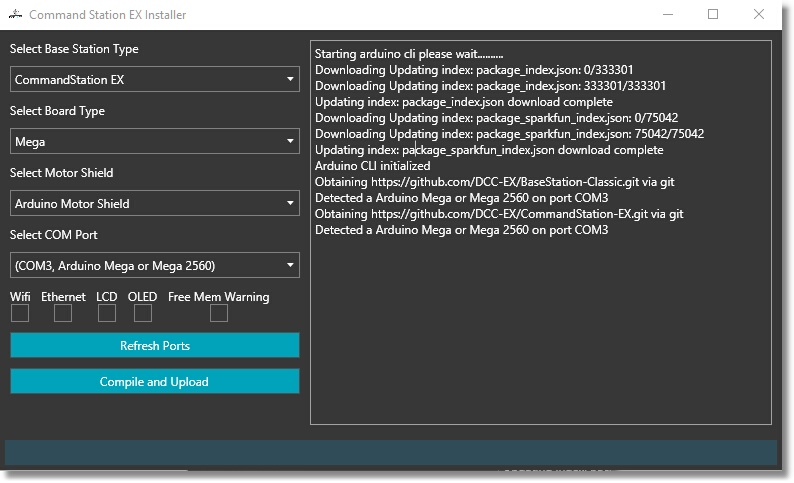

# Installer Setup

## Requirements

- Windows/Linux/MacOS Computer

- DCC-EX Compatible motor shield / motor controller board

- DCC-EX Compatible Microcontroller such as Arduino Mega/Uno or SparkFun SAM21 Development board

- USB cable to connect your computer to the Microcontroller Trains
    
!!! NOTE
    For all versions make sure your USB Cable is conncted from your computer to the Command Station (CS). Make sure no other programs are using the computer's serial port

## To run on Windows

1. Download files depends on your system

    [Windows 64bit Installer](https://github.com/DCC-EX/BaseStation-Installer/releases/download/v2.0/BaseStationInstaller-win-x64.zip){: .downloadBtn}

    [Windows 32bit Installer](https://github.com/DCC-EX/BaseStation-Installer/releases/download/v2.0/BaseStationInstaller-win-x86.zip){: .downloadBtn}


2. Extract the Installer into its own folder

3. Open the folder and run the BaseStationInstaller.exe

## To run on MacOSX

1. Download MacOSX Installer

    [MacOSX Installer](https://dotnet.microsoft.com/download/dotnet-core/thank-you/sdk-3.1.301-macos-x64-installer){: .downloadBtn}

2. Extract the Installer into its own folder.

3. Open a terminal window and navigate to that folder

4. Run the following command

    ``dotnet BaseStationInstaller``

## To run on Linux (including the Raspberry Pi)

1. Download Linux Installer

    [Linux Installer](https://docs.microsoft.com/en-us/dotnet/core/install/linux){: .downloadBtn}

2. Download and Extract the Installer into its own folder.

3. Open a terminal window and navigate to that folder

4. Run the following command

     ``dotnet BaseStationInstaller``

## The Installer Window


<br>
Figure 1 - Installer Window

There will be a lot of information appearing in the log window which can help us debug things if anything goes wrong. The installer needs to connect online to download the latest packages to support your hardware. It will take a few seconds to complete, this is normal. If you have a very slow internet connection it will take longer.

## Choose your options

In the left side options pane use the dropdown selector boxes choose the following options:
<br>
<br>


<br>
Figure 2 - Options Pane

* Select your Commmand Station Type (CommandStation EX or BaseStation Classic)
* Select your Arduino Board Type (this should be a Mega 2560)
* Select your Motor Shield (usually Arduino Motor Shield)
* Select your com port (The installer should find it for you)
* Check the checkbox for your networking method if you have a Network shield or Wifi Shield installed (check WiFi or Ethernet)
* Check the checkbox for your display type if using an LCD or OLED display
* check the Free Mem warning if you need to diagnose memory issues
* Press the "Compile and Upload" button

### WiFi Checkbox 

If you have installed a WiFi board, DCC++ EX will scan all the serial ports on your Mega and find it. If you wish to use Access Point Mode (aka AP Mode), there is nothing to do, DO NOT CHECK THIS BOX. AP mode sets up the CS to be its own network router. To use it, you connect your phone or other WiFi device to this network instead of your home network. You will see a new network when you use the connect option on your phone that looks like "DCC-EX-xxxxxx" where the "xxxxxx" are the last 6 characters of the MAC address of your WiFi board. Simply connect to that network and you have a direct connection to your CS.

If you wish to connect to your home network instead (connect to your router using "Station Mode"), then check this box. You will then need to enter your credentials to login to your network just like you would from any of your other WiFi devices:


<br>
Figure 3 - Wifi Options

**WiFi SSID** - The name of your home network<br>

**WiFi Password** - The password required to connect to your home network<br>

**Host Name** - If your WiFi Board supports it, this name can be used in addition to the IP address.<br>

**Server Port** - This is the communication port our internal WiThrottle server uses to communicate with devices like Engine Driver. We recommend leaving it set to 2560 because JMRI also uses that port should you ever want to use JMRI<br>

**IP Address** - Normally, the DHCP server for your network will assign and IP address and you should leave this blank. But if you want to assign an IP address so the CS always uses the same one, you can enter it here.<br>

### Ethernet Checkbox

If you have an Ethernet shield and check this box, you will see options to be able to change the following options:


<br>
Figure 4 - Ethernet Options

**Host Name** - If your WiFi Board supports it, this name can be used in addition to the IP address.<br>

**Server Port** - This is the communication port our internal WiThrottle server uses to communicate with devices like Engine Driver. We recommend leaving it set to 2560 because JMRI also uses that port should you ever want to use JMRI<br>

**MAC Address** - This is the unique identifier for your Ethernet Shield. We recommend leaving this setting as is. If you ever have more than one Ethernet shield on your network and there is a conflict, you can change this setting.

**IP Address** - Normally, the DHCP server for your network will assign and IP address and you should leave this blank. But if you want to assign an IP address so the CS always uses the same one, you can enter it here.<br>


### LCD Checkbox

If you have a 2 or 4 line LCD diplay connected <insert link here> and check this box, you will see the following options you can edit for your display:


<br>
Figure 5 - LCD Options

***LCD Address (in Decimal format)*** - This is the address of your display, it us usually 39 (for 0x27)or 63 (for 0x3F)

***LCD Columns*** - The number over vertical columns on your display

***LCD Rows*** - The number of horizontal rows or lines on your display

For more information about using displays, click [I2C Displays](../hardware/i2c-displays.md)

### OLED CheckBox

If you have an OLED display connected <insert link here> and check this box, you will see the following options you can edit for your display:


<br>
Figure 6 - OLED Options

***OLED Width (in pixels)*** - Enter the width or number of horizontal pixels on your display

***OLED Heigh (in pixels)*** - Enter the heighr or number of vertical pixels on your display

For more information about using displays, click [I2C Displays](../hardware/i2c-displays.md)

### Refresh Ports Button

This button allows you to refresh the serial ports in case you didn't have the Arduino connected when you opened the program or if you will be programming multiple Arduinos. When you plug in a new board, refresh the ports so it can find your device.

### Compile and Upload Button

Once you have configured your options, press this button to compile all the source code and upload it to your Command Station.

## Test your setup

### Using the Arduino IDE Serial Monitor

To test with the Arduino Serial Monitor, download the Aduino IDE from the following link and install it on your computer.

[Download the Arduino IDE](https://www.arduino.cc/en/Main/software)

To do a quick test, open the Arduino application:


<br>
Figure 7 - The Arduino IDE

* Select "Tools -> Serial Monitor" from the Arduino IDE menu


<br>
Figure 8 - Open the Serial Monitor from the Tools Menu

You will see the following screen:


<br>
Figure 9 - Serial Monitor

* Select "115200" as the baud rate in the dropdown in the lower right
* Select "Both NL & CR" from the dropdown next to the baud rate

The last option makes sure that a new line characters and a carriage return is sent with every command. This is important or the CS will not accept commands because it won't recognize when entering the command is finished.

When you open the serial monitor you will see at least one line sent out as status information. If you have a WiFi board or Ethernet Shield you will see a page full of log information as it configures and connects to your network.

At the top of the serial monitr type ```<s>``` (lowercase "s" surrounded by the "less than" and "greater than" signs) into the command textbox and press "Send". You should see:

```
<iDCC-EX V-0.2.1 / MEGA / STANDARD_MOTOR_SHIELD G-9db6d36>
```

This is the "status" command and reports your version, types of boards you are using and a build number that lets us know exactly which version of the software you are using down to the day and time we created it. This can help us in debugging

There are a lot of other commands you can enter here. As a matter of fact, you could use the serial monitor to test any of the DCC-EX API (application programming interface) commands. You could even program your loco. Please see the [DCC++ EX Wiki](https://github.com/DCC-EX/CommandStation-EX/wiki) or the DCC++ Commands page for a list of commands <insert link here>

### Using exWebthrottle


<br>
Figure 10 - exWebThrottle

Click this link: [exWebThrottle](..//throttles/ex-webthrottle.md) to go to the exWebThrottle web page where you have a choice to either run the throttle immediatly from our server or download a zip file that you can unzip and run in a browser from your local machine. This is the fastest way to get started.

### Using Engine Driver (or other WiThrottle CAB) - Requires WiFi


<br>
Figure 11 - Engine Driver

You will need to install Engine Driver on your mobile device and then connect to the CS either directly with AP mode or through your router with Station Mode. You can then use your phone to control your trains. Click here for instructions on using Engine Driver <insert link here>
