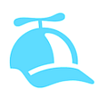

# Choose Your Path

We have broken down who are users are into three categories and created different paths to navigate our DCC-EX system and this website. Don't worry, the paths are integrated and you can "switch a turnout" at any point and take another path. See below if you most identify with being a, "Conductor", a "Tinkerer" or an "Engineer".

### Conductor

A Conductor mostly just wants to enjoy operating trains. You could be someone new to trains or picking it up after a long absence, or you could be someone coming from running DC and looking to switch over to DCC. This is also the perfect place for someone who just wants something that works without much tinkering. We provide an "out of the box" working solution that gives you a Command Station and a Controller and you are up and running in just a few minutes. In short, a conductor wants to drive trains and doesn't want to have to deal with the details of the hardware or software involved. This path will keep things simple.

## Tinkerer

A Tinkerer likes the joy of building things themselves. They may not have an Engineering Degree, but they know how to connect a jumper wire and possibly use a soldering iron. They don't have a problem opening something like the Arduino IDE to change settings in a configuration file and upload it back to their Command Station. A Tinkerer wants to do more with model trains like using different motor controllers or getting into more detailed control of turnouts, sensors and other accessories. You may still use our standard Command Station kit, but many of you will build your own Command Station using an Arduino board and a Motor Shield. This path will provide more options over the Conductor path and cover things like using the JMRI software (Java Model Railroad Interface) for more advanced control of your locomotives and your track.

## Engineer

An Engineer is a little more versed in computers and/or electronics. They have a desire to dig a little deeper into how things work. They can understand the basics of computer code and can look at the DCC++ EX program to at least make simple changes. They may want to help with offering their talents to the project. They are not averse to experimenting with things to make something work. These are the people whose layout looks like a telephone switching station when you look under their benchwork. This path will offer more technical information and cover more in depth topics like accessory control and customizing the DCC++ EX System.

Keep these definitions in mind as you proceed through this website. Here is your first choice:

You want to use a FireBox Command Station

You want to put your Command Station together yourself using an Arduino board [DIY Starter Kit](diy-starter-kit.md)