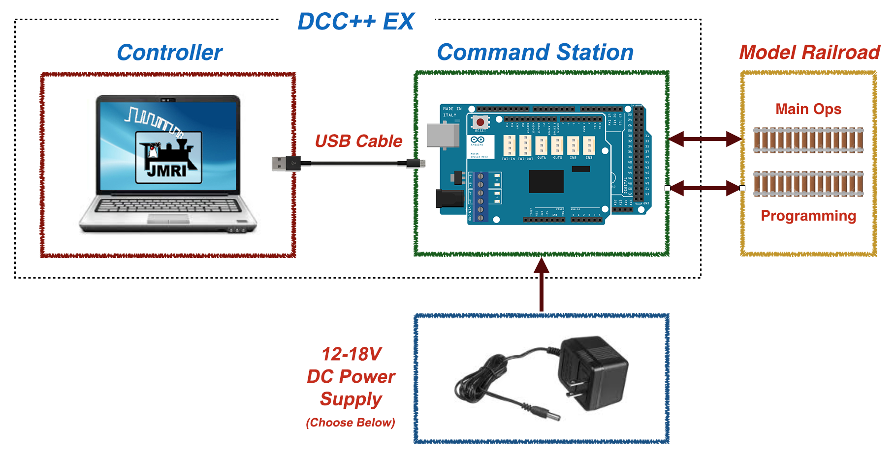

# DCC++ EX Starter Kit

This guide is designed for do-it-yourselfers to build their own system. Anyone can do it, however if you don't feel technically inclined or just want to save the time, you can purchase a starter kit that contains:

* __Controller:__ A Raspberry Pi with SD Card already configured with everything you need including the JMRI software. 
* __Base Station:__ An Arduino with DCC++ software already uploaded and a Motor Controller Shield prepped and installed

*Suppliers list coming soon*

# What You Will Need

- A "main" track or "operations" - most people already have this, it's your layout
- A "programming" track or "service" track - a short section of track that you will use to program locomotives and other pieces of equipment
- A known-good locomotive equipped with a DCC decoder

### Equipment List:

#### Hardware

* A compatible Arduino Board
  * Arduino UNO R3 (clones work too)
  * Arduino Mega (clones work too)
  * Arduino Nano
* A compatible motor driver shield
  * Arduino Motor Driver Shield Rev 3 (clones work too)
  * Pololu MC33926 Dual Motor Driver Shield (https://www.pololu.com/product/2503)
  * Other boards listed in the hardware section
* DC Power Supply (see [Power Supplies](../hardware/power-supplies.md)) 
* USB A to B Cable (aka USB Printer Cable)
* Computer to act as a controller to the Arduino Base Station \*

#### Software

* DCC++ EX repository
* JMRI
* Arduino IDE to upload DCC++ to the Arduino

\* You can use a MAC or a Raspberry Pi (Which we recommend) that is covered in another Guide

Next Page: [Assembly](assembly.md)
