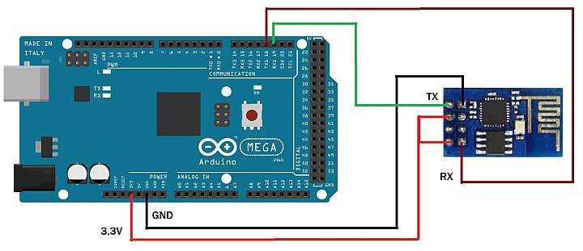

# WiFi Setup

There are many ways to add Wifi to your CS. We will cover three methods here. Any level from Conductor to Engineer should be comfortable here, however you will need to know a little bit about networking. If you can get your phone and your Roku to connect to your network, you can do this. You should be able to apply what you learn here to using other boards, but you can ask us for help using any of the links on our [Support Page](../support/get-support.md) if you have a question. 

## Why Use WiFi?

The biggest reason many people want to add WiFi is to go wireless! With the base CS consisting of an Arduino Mega and an Arduino Motor Shield, you must use a serial cable to connect to a computer to run JMRI, our WebThrottle-EX, or other another Controller. The controller is what sends commands to the CS to run your trains and control your accessories.

An astute observer may note that you can go wireless when using software like JMRI. That's true! But you need another computer to do it. With DCC++ EX WiFi, you can connect directly to your CS from any WiThrottle capable throttle, such as the Engine Driver phone app.

Previously, to connect a wireless throttle like Engine Driver to the CS, you needed another computer running JMRI (The Java Model Railroad Interface Program) with that computer connected to the CS via a serial cable. JMRI exposes a "WiThrottle Server" on the Wifi capable computer it runs on. You would then connect Engine Driver wirelessly to that computer and the computer and JMRI act as middleware to connect to the CS. And this is a great solution. Plenty of people want to take advantage of all the functionality inside JMRI that can run your entire layout. But many of you tell us that you just want to run trains. So whether you are at a show or just have a layout at home where a throttle (aka CAB) will do everything you need, you can connect directly to the CS without any other hardware or software.

## Compatible Boards

Most boards based on the ESP-8266 should work with DCC++ EX. However, with all the variations and software versions out there, we've compiled this list of known tested, working hardware. We will add more over time.

* [Makerfabs ESP-8266 WiFi Shield](https://www.makerfabs.com/esp8266-wifi-shield.html)
* [Duinopeak ESP-8266 WiFi Expansion Board (plus an ESP-01 or 01s)](https://usa.banggood.com/Duinopeak-ESP8266-ESP-01-WiFi-Expansion-Board-Shield-Without-ESP8266-Module-p-1391961.html?cur_warehouse=CN)
* [ESP-01 or ESP-01s Board (This is not a shield. You will need to jumper 5 wires)](https://www.amazon.com/DIYmall-ESP8266-ESP-01S-Serial-Transceiver/dp/B00O34AGSU/ref=pd_lpo_147_t_1/130-6340217-7680634?_encoding=UTF8&pd_rd_i=B00O34AGSU&pd_rd_r=da1c0b41-50d5-4d74-9eb7-47ff01e28033&pd_rd_w=R8UcG&pd_rd_wg=VsHQz&pf_rd_p=7b36d496-f366-4631-94d3-61b87b52511b&pf_rd_r=KNZV9WH99PH2PKF541N3&psc=1&refRID=KNZV9WH99PH2PKF541N3)

!!! Note
    All the boards mentioned here operate on the 2.4GHz band. And a fun fact is that the DCC signal averages around 8kHz (It varies between 5kHz and 8.6kHz). That means it cycles between states 8,000 times a second. 2.4GHz is in the microwave band (which is why a leaky microwave oven can wreak havoc on your network) which switches back and forth 2.4 BILLION times per second!

## What you will need

* A Command Station (CS) made from a Mega and an Arduino Motor Shield
* One of the above boards
* Two (2) Male to Female Jumpers (plus 3 more if you are using an ESP-01 or 01s)

## Makerfabs ESP-8266 WiFi Shield (recommended)

We like this board at DCC++ EX labs. It is simple, inexpensive, easy to use, and it works.

{: align=center }
 
Figure 1 - Makerfabs ESP-8266 WiFi Shield

Installing the board follows the same procedure in the previous section on [assembly](assembly.md). Start by noting the tab end of the board and align it with the tab end of the motor board. You will stick this board on top to make a three board stack.

### Remove the plastic jumpers

Note the two black plastic jumpers, we need to remove both of them. You can pull them off with your fingers or needle nose pliers and either stick them in a drawer or move them to the side by having them connect via one side to any of the row of Rx pins. The other end of the connector will just hang out over the Wifi Board.

{: align=center }
 
Figure 2 - Remove the plastic jumpers

### Align the boards

Turn the board so that the tab end is to the left and the power connectors on the other boards are to the right. You will be looking at the left side of the shield. Align it so that the pins align starting with the tab end of the boards. The Tx, Rx, 2, 3, 4, 6, 6, 7 pins on the Motor Shield line up with the 0 through 7 pins on the Makerfabs WiFi Board. Start to get this row partially seated so all the pins are lined up with the holes. Note that there are more holes than pins. The two header holes closest to the power connectors will be empty.

{: align=center }
 
Figure 3 - Get the left side pins aligned

### Seat the boards

Now do the the other side. If all the pins are straight and lined up properly, hold both sides of the board and press it together gently (Figure 4). Note that the pins are quite long and will not go all the way into the header. You shoud have even more of the pins showing between the bottom of the WiFi board and the top of the header on the Motor Board than between the Motor Board and the Arduino. This is normal (Figure 5).

{: align=center }
 
Figure 4 - Get the right side pins aligned
 

{: align=center }
 
Figure 5 - Fully Seated Boards

### Install the jumper wires

We now need to connect The Transmit (Tx) and Receive (Rx) pins on the ESP-8266 to the Rx and Tx pins for Serial1 on the Mega. The mega has one serial port connected to the USB port and then 3 extra ones we can access from pins on the board. You can think of Tx as "talking" and Rx as "listening". That will help you remember that if one thing is talking, the other has to use its ears to listen. So we must connect the Tx of the WiFi board to Rx1 on the Mega and the Rx pin on the WiFi Board to Tx1 on the Mega.

There are three rows of pins on the Makerfabs WiFi shield. The middle pins each connect to one of the first 8 pins on the header. Pin 0 goes to header pin 0, pin 1 goes to header pin 2, and so on. We aren't going to need those. With the plastic jumpers removed, nothing will be connected to any of those pins on the WiFi Board and therefore not connected down to the Mega through the Motor Shield.

ALL of the pins in the row marked Tx (the row closest to the header) are connected to the Tx pin of the ESP-8266. ALL of the pins in the row marked Rx (the row closes to the middle of the board) are connected to the Rx pin on the ESP-8266

Take a jumper wire and connect it to any one of the Tx pins on the WiFi Board and connect the other end to the Rx1 pin on the mega (pin 19)

Take a second jumper wire and connect it to any one of the Rx pins on the Wifi Board and connect the other end to Tx1 on the mega (pin 18)

{: align=center }
 
Figure 6 - Install the jumper wires

!!! Note
    The screen printing on the board may make it hard to see which pins are 18 and 19, they may not be aligned exactly. Count the pins if you need to to make sure that you are using the correct ones.

### Install the software

If you already have the CS sofware running and are just adding WiFi, there is nothing further you need to do if you want to use the CS as an Access Point (AP) and connect a WiThrottle compatible CAB (Engine Driver). The next time you power up the CS, it will automatically find your WiFi board and what port it is connected to. See the detailed instructions here [WiFi Configuration](wifi-config.md)

If you are setting up your Command Station for the first time, or are making changes click on the basic setup link below to install your software onto the CS.

[Next Step: Installing the sofware](#installing-the-software)

## Duinopeak ESP-8266 WiFi Expansion Board

This board is designed as an expansion/prototyping board as well as a WiFi board. So you Tinkerers or Engineers that want the extra space on the board to solder your expriements can have a party on PCB. The only caveat with this board is that it cannot easily be connected in "passthrough mode" if you needed to use the Arduino to test a direct connection to the on board ESP-8266. It does not like the USB cable connected at the same time as a signal is on the Tx/Rx pins. This is a minor issue and does not affect normal operation since you won't have anything connected to the USB port.

!!! Note
    This is just a carrier board for an ESP-01 or 01s. You will still need an ESP-01s to stick onto this board. See the next section.

 
Figure 7 - Duinopeak WiFi Board

### Install the Hardware

To install this board on your Arduino, follow the same steps as above with the added step of installing and ESP-01s onto the board:

* Remove or place the plastic pin jumpers to the side
* Align and seat the board
* Use wire jumpers to connect any Rx pin to Tx1 on the Mega and any Tx pin to Rx1 on the Mega
* Seat an ESP-01s onto the 8 pin header on the board oriented with the white ESP-01 outline

### Install the Software

If you already have the CS sofware running and are just adding WiFi, there is nothing further you need to do if you want to use the CS as an Access Point (AP) and connect a WiThrottle compatible CAB (Engine Driver). The next time you power up the CS, it will automatically find your WiFi board and what port it is connected to. See the detailed instructions here <add wifi connect link>

If you are setting up your Command Station for the first time, or are making changes click on the "Installing the sofware" link below to install your software onto the CS.

[Next Step: Installing the sofware](#installing-the-software)

## ESP-01 or ESP-01s

This is the board that started it all. It fueled the WiFi revolution in small devices. In fact, this little board is actually a microcontroller that is more powerful than the Arduno Uno! The difference between the 01 and the 01s is prirmarily that there is more memory on the 01s. Since the 01 version has been retired, any new board you get should be the 01s, but either will work.

 
Figure 8 - ESP-01s

### Install the Hardware

Below is a wiring diagram for connecting the ESP-8266 to the Arduino. For clarity, the image does not show the motor board already on top of the Mega, but since the headers connect all the pins together vertically, you can find the same pins on the motor board to get the 3.3V and Gnd to power the ESP-8266.

 
Figure 9 - Wiring and ESP-01s to a Mega

__Wiring__

    Arduino   ESP8266
    3.3V -----> Vcc
    3.3V -----> CH_PD
    Gnd  -----> Gnd
    Tx   -----> Rx
    Rx   -----> Tx

In order to connect both Vcc and CH_PD to the 3.3V output of the arduino, you can make a "Y" shaped jumper or put the ESP-01s on a small circuit board and wire it that way. Below are little boards you can buy called "ESP-01 Breakout Board" or "ESP-01 Breadboard adapter". Some even have a voltage regulator so you can use the 5V power from the Mega instead of 3.3V

!!! Note about current requirements
    While we at DCC-EX Labs have had success with running the ESP-01s off the 3.3V Mega power supply, this is at the limit of what the Mega can supply. The Mega 3.3V regulator is only rated for 200mA. The ESP can exceed this in short bursts. If you want to be safe, you can power a 5V to 3.3V regulator from the 5V supply or find another way to provide clean, regulated 3.3V to the ESP

 
Figure 10 - ESP-01 Breakout Boards

!!! Note
    The ESP-8266 chips are designed for 3.3V DO NOT TRY TO CONNECT THEM TO 5V!! But while they cannot handle 5 volts for power, their GPIO pins are 5V tolerant. Because of that, and the fact that the Mega will still see 3.3V as a "high" signal, you don't need any other circuitry.

### Install the Software

If you already have the CS sofware running and are just adding WiFi, there is nothing further you need to do if you want to use the CS as an Access Point (AP) and connect a WiThrottle compatible CAB (Engine Driver). The next time you power up the CS, it will automatically find your WiFi board and what port it is connected to. See the detailed instructions here <add wifi connect link>

If you are setting up your Command Station for the first time, or are making changes click on one of the install links below to install your software onto the CS.

If you want more information about Wifi or to change your [Wifi Configuration](wifi-config.md) click this hyperlink.

## Installing the software

__Next Page__

* If you are ready to install the software using the DCC-EX Installer

[Install using the Automated Installer](installer-setup.md)

* If you are installing using the Arduino IDE

[Install using the Arduino IDE](arduino-ide-setup.md)
